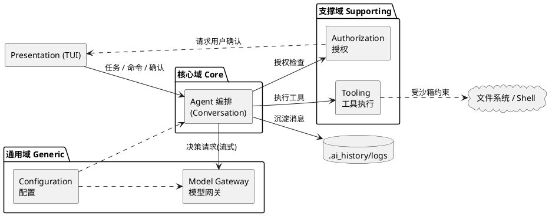
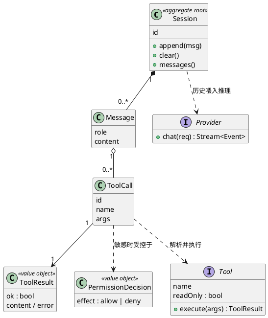

# Design: 领域模型（DDD，精炼版）

> 状态：active · 最后更新：2026-06-27 · 抽象层：**②领域**（在用例之后、系统设计之前）
> 边界优先：先定限界上下文与统一语言，再谈聚合与实现。保持精炼——只为本项目真实需要建模。

## 统一语言（Ubiquitous Language）

代码、文档、对话一律使用同一套词汇，避免同义词漂移：

| 术语 | 含义 |
|---|---|
| **Task 任务** | 开发者一次自然语言意图 |
| **Session 会话** | 共享上下文的一段对话，由多个 Turn 组成 |
| **Turn 轮次** | 一次「模型推理 + 由此产生的工具执行」 |
| **Message 消息** | 会话历史的最小单元（system/user/assistant/tool） |
| **Tool 工具** | 暴露给模型的结构化能力（只读 or 敏感） |
| **ToolCall / ToolResult** | 模型发起的工具调用 / 其结构化结果（成功或错误） |
| **Permission Decision 授权决策** | 对敏感工具调用的 allow/deny |
| **Provider 模型网关** | 对接 LLM 协议、产出流式事件 |
| **Skill 技能** | 一个本地 `SKILL.md` 沉淀的可复用工作流/领域知识；三级渐进式披露（L1 目录 / L2 正文 / L3 资源） |

## 限界上下文（Bounded Contexts）

按 DDD 把领域切成少量边界清晰的上下文，并标注重要性等级：

| 上下文 | 等级 | 职责 | 不负责 |
|---|---|---|---|
| **Agent 编排（Conversation）** | 核心域 | 会话/轮次/历史、决策→工具→结果→再决策的编排、守护栏 | 不做 IO/渲染/HTTP |
| **Tooling 工具执行** | 支撑域 | 工具定义、执行、路径沙箱、错误归一 | 不认识模型 |
| **Authorization 授权** | 支撑域 | 敏感操作的 allow/deny、会话级 allowlist | 不执行工具 |
| **Model Gateway 模型网关** | 通用域 | 协议封装、流式、超时、重试 | 不认识工具语义 |
| **Configuration 配置** | 通用域 | 用户级/项目级合并、密钥保护 | 不持有运行状态 |
| **Presentation（TUI）** | 表现层 | 输入/输出/状态/确认交互 | 不内嵌业务逻辑 |
| **Skills 能力扩展** | 支撑域 | 发现/解析两级 `SKILL.md`、L1 目录注入与按需加载正文 | 不认识 Agent Loop；仅经 system prompt 与 `use_skill` 工具进入上下文 |

> 核心域是 **Agent 编排**——这是本项目的差异化所在，投入最多设计；其余按支撑/通用域对待，能简则简。

## 上下文映射（Context Map）

## 领域模型（核心域聚合）

**Session 为聚合根**，统一管理一致性边界（消息顺序、轮次）。`ToolResult` / `PermissionDecision` 为值对象。

## 不变量（Invariants，由 harness 强制）

1. 消息按时间有序追加；工具结果必跟在对应 `assistant + tool_calls` 之后。
2. 敏感工具（`readOnly=false`）执行前必有一条 `PermissionDecision`。
3. 拒绝 → 不执行 + 生成 `ToolResult{ok:false}` 入会话。
4. 一切文件/Shell 作用对象落在项目根内。

## 相关
- 上一层（用例）→ [`use-cases.md`](use-cases.md)
- 下一层（系统设计/分层落地）→ [`../../ARCHITECTURE.md`](../../ARCHITECTURE.md)
- 关键流程时序 → [`flows.md`](flows.md)
