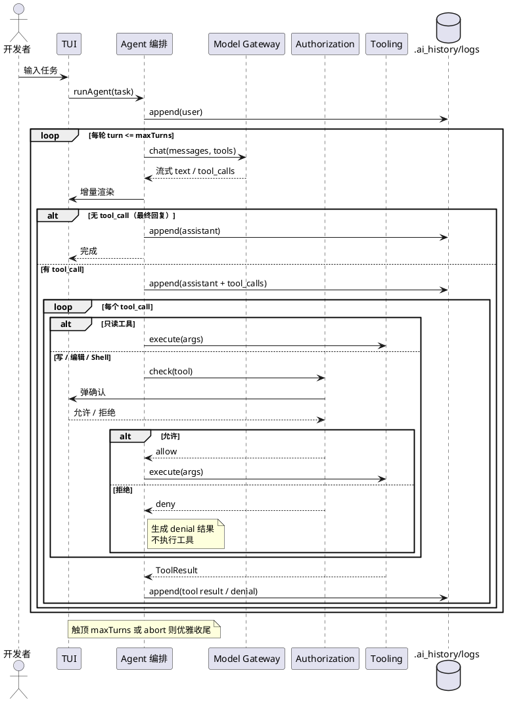

# Design: 关键流程时序（从整体到局部）

> 状态：active · 最后更新：2026-06-27 · 抽象层：跨①用例 / ②领域 / ③系统
> 时序图用来**整体理解流程**：把 UC1（下达任务）落到限界上下文之间的协作。

## 主流程：一次任务的 Agent Loop（含权限分支）

覆盖「模型决策—工具调用—结果回传—继续推理」+ 只读直过 / 敏感需确认 / 拒绝入上下文。

## 触发路径与终止
- **触发**：UC1（自然语言任务）。
- **终止**：无 tool_call（完成）/ 触顶 `maxTurns` / 用户中断(abort) / 致命错误。

## 相关
- 用例 → [`use-cases.md`](use-cases.md)
- 领域模型 → [`domain-model.md`](domain-model.md)
- 主循环规格 → [`../product-specs/agent-loop.md`](../product-specs/agent-loop.md)
- 权限规格 → [`../product-specs/permissions.md`](../product-specs/permissions.md)
