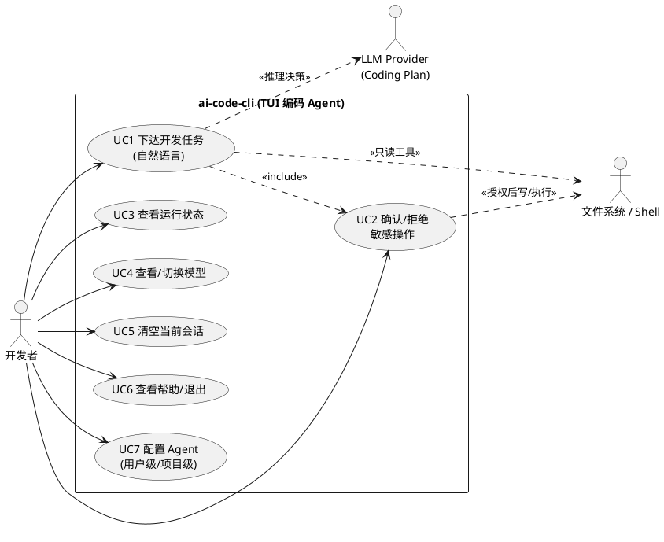

# Design: 业务用例（最顶层抽象）

> 状态：active · 最后更新：2026-06-27 · 抽象层：**①用例**（先于领域/系统/编码）
> 方法论：不弄清业务用例，不进入领域设计。本文回答「**谁、想达成什么**」，不涉及实现。

## 参与者（Actors）

| 参与者 | 类型 | 说明 |
|---|---|---|
| 开发者 | 主要 | 在终端通过自然语言下达开发任务、做权限决策、管理会话 |
| LLM Provider（Coding Plan） | 外部系统 | 提供模型推理与工具调用决策 |
| 文件系统 / Shell | 外部系统 | 工具执行的真实作用对象（限项目根内） |

## 核心业务目标（一句话）

> 开发者用自然语言描述意图，系统**自主规划→调用工具→基于结果继续推理**，在**人类对敏感操作保留否决权**的前提下完成开发任务。

## 用例清单

| 用例 | 触发 | 成功标准 |
|---|---|---|
| UC1 下达开发任务 | 自然语言输入 | 任务完成 / 失败终止 / 明确回复 |
| UC2 确认或拒绝敏感操作 | 工具需写/编辑/执行 Shell | 允许→执行；拒绝→不执行且结果入上下文 |
| UC3 查看运行状态 | `/status` | 展示模型、轮次、Key 是否配置（不显明文） |
| UC4 查看/切换模型 | `/model [id]` | 当前模型可见、可切换 |
| UC5 清空当前会话 | `/clear` | 上下文清空、开新会话日志 |
| UC6 查看帮助 / 退出 | `/help` `/exit` | — |
| UC7 配置 Agent | 用户级/项目级配置文件 | 项目级优先；密钥不暴露 |

> UC1 在执行中**内含** UC2（敏感操作必经确认）——这是系统的核心约束，不是可选项。

## 用例图

## 相关
- 下一层（领域模型）→ [`domain-model.md`](domain-model.md)
- 关键流程时序 → [`flows.md`](flows.md)
- 需求权威来源 → [`../references/l2-task-brief.md`](../references/l2-task-brief.md)
